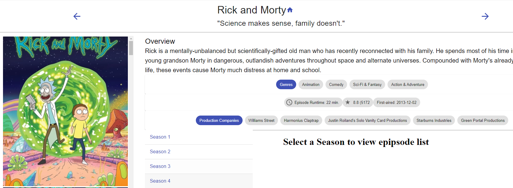
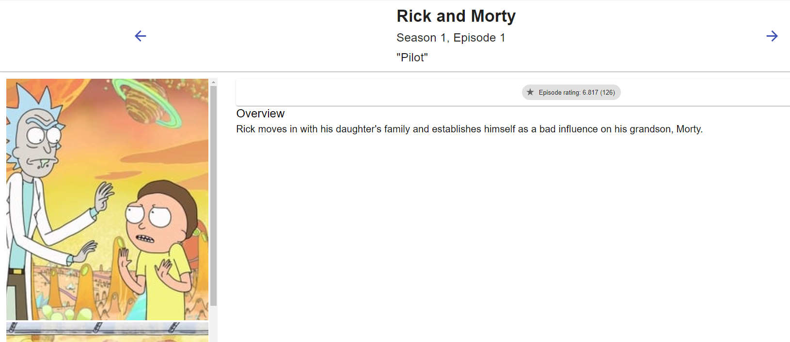

# Assignment - ReactJS app.

Name: Tadhg Conneely

## Overview.

This app is an expanded version of the Movie App that was used in the module labs

Features:
 + Tv Shows
 + Seasons
 + Episodes
 + Full Story Support

## Setup requirements.

To use this app, register an API key at TMDB () and place the key in a .env file under the name REACT_APP_TMDB_KEY

## API Data Model.

- Tv Shows
    - Endpoint:
        - https://api.themoviedb.org/3/tv/{tv_id}
    - Sample Response:
        ```
        {
            "backdrop_path": "/suopoADq0k8YZr4dQXcU6pToj6s.jpg",
            "created_by": [
                {
                "id": 9813,
                "credit_id": "5256c8c219c2956ff604858a",
                "name": "David Benioff",
                "gender": 2,
                "profile_path": "/xvNN5huL0X8yJ7h3IZfGG4O2zBD.jpg"
                },
                {
                "id": 228068,
                "credit_id": "552e611e9251413fea000901",
                "name": "D. B. Weiss",
                "gender": 2,
                "profile_path": "/2RMejaT793U9KRk2IEbFfteQntE.jpg"
                }
            ],
            "episode_run_time": [
                60
            ],
            "first_air_date": "2011-04-17",
            "genres": [
                {
                "id": 10765,
                "name": "Sci-Fi & Fantasy"
                },
                {
                "id": 18,
                "name": "Drama"
                },
                {
                "id": 10759,
                "name": "Action & Adventure"
                },
                {
                "id": 9648,
                "name": "Mystery"
                }
            ],
            "homepage": "http://www.hbo.com/game-of-thrones",
            "id": 1399,
            "in_production": false,
            "languages": [
                "en"
            ],
            "last_air_date": "2019-05-19",
            "last_episode_to_air": {
                "air_date": "2019-05-19",
                "episode_number": 6,
                "id": 1551830,
                "name": "The Iron Throne",
                "overview": "In the aftermath of the devastating attack on King's Landing, Daenerys must face the survivors.",
                "production_code": "806",
                "season_number": 8,
                "still_path": "/3x8tJon5jXFa1ziAM93hPKNyW7i.jpg",
                "vote_average": 4.8,
                "vote_count": 106
            },
            "name": "Game of Thrones",
            "next_episode_to_air": null,
            "networks": [
                {
                "name": "HBO",
                "id": 49,
                "logo_path": "/tuomPhY2UtuPTqqFnKMVHvSb724.png",
                "origin_country": "US"
                }
            ],
            "number_of_episodes": 73,
            "number_of_seasons": 8,
            "origin_country": [
                "US"
            ],
            "original_language": "en",
            "original_name": "Game of Thrones",
            "overview": "Seven noble families fight for control of the mythical land of Westeros. Friction between the houses leads to full-scale war. All while a very ancient evil awakens in the farthest north. Amidst the war, a neglected military order of misfits, the Night's Watch, is all that stands between the realms of men and icy horrors beyond.",
            "popularity": 369.594,
            "poster_path": "/u3bZgnGQ9T01sWNhyveQz0wH0Hl.jpg",
            "production_companies": [
                {
                "id": 76043,
                "logo_path": "/9RO2vbQ67otPrBLXCaC8UMp3Qat.png",
                "name": "Revolution Sun Studios",
                "origin_country": "US"
                },
                {
                "id": 12525,
                "logo_path": null,
                "name": "Television 360",
                "origin_country": ""
                },
                {
                "id": 5820,
                "logo_path": null,
                "name": "Generator Entertainment",
                "origin_country": ""
                },
                {
                "id": 12526,
                "logo_path": null,
                "name": "Bighead Littlehead",
                "origin_country": ""
                }
            ],
            "production_countries": [
                {
                "iso_3166_1": "GB",
                "name": "United Kingdom"
                },
                {
                "iso_3166_1": "US",
                "name": "United States of America"
                }
            ],
            "seasons": [
                {
                "air_date": "2010-12-05",
                "episode_count": 64,
                "id": 3627,
                "name": "Specials",
                "overview": "",
                "poster_path": "/kMTcwNRfFKCZ0O2OaBZS0nZ2AIe.jpg",
                "season_number": 0
                },
                {
                "air_date": "2011-04-17",
                "episode_count": 10,
                "id": 3624,
                "name": "Season 1",
                "overview": "Trouble is brewing in the Seven Kingdoms of Westeros. For the driven inhabitants of this visionary world, control of Westeros' Iron Throne holds the lure of great power. But in a land where the seasons can last a lifetime, winter is coming...and beyond the Great Wall that protects them, an ancient evil has returned. In Season One, the story centers on three primary areas: the Stark and the Lannister families, whose designs on controlling the throne threaten a tenuous peace; the dragon princess Daenerys, heir to the former dynasty, who waits just over the Narrow Sea with her malevolent brother Viserys; and the Great Wall--a massive barrier of ice where a forgotten danger is stirring.",
                "poster_path": "/zwaj4egrhnXOBIit1tyb4Sbt3KP.jpg",
                "season_number": 1
                },
                {
                "air_date": "2012-04-01",
                "episode_count": 10,
                "id": 3625,
                "name": "Season 2",
                "overview": "The cold winds of winter are rising in Westeros...war is coming...and five kings continue their savage quest for control of the all-powerful Iron Throne. With winter fast approaching, the coveted Iron Throne is occupied by the cruel Joffrey, counseled by his conniving mother Cersei and uncle Tyrion. But the Lannister hold on the Throne is under assault on many fronts. Meanwhile, a new leader is rising among the wildings outside the Great Wall, adding new perils for Jon Snow and the order of the Night's Watch.",
                "poster_path": "/5tuhCkqPOT20XPwwi9NhFnC1g9R.jpg",
                "season_number": 2
                },
                {
                "air_date": "2013-03-31",
                "episode_count": 10,
                "id": 3626,
                "name": "Season 3",
                "overview": "Duplicity and treachery...nobility and honor...conquest and triumph...and, of course, dragons. In Season 3, family and loyalty are the overarching themes as many critical storylines from the first two seasons come to a brutal head. Meanwhile, the Lannisters maintain their hold on King's Landing, though stirrings in the North threaten to alter the balance of power; Robb Stark, King of the North, faces a major calamity as he tries to build on his victories; a massive army of wildlings led by Mance Rayder march for the Wall; and Daenerys Targaryen--reunited with her dragons--attempts to raise an army in her quest for the Iron Throne.",
                "poster_path": "/7d3vRgbmnrRQ39Qmzd66bQyY7Is.jpg",
                "season_number": 3
                },
                {
                "air_date": "2014-04-06",
                "episode_count": 10,
                "id": 3628,
                "name": "Season 4",
                "overview": "The War of the Five Kings is drawing to a close, but new intrigues and plots are in motion, and the surviving factions must contend with enemies not only outside their ranks, but within.",
                "poster_path": "/dniQ7zw3mbLJkd1U0gdFEh4b24O.jpg",
                "season_number": 4
                },
                {
                "air_date": "2015-04-12",
                "episode_count": 10,
                "id": 62090,
                "name": "Season 5",
                "overview": "The War of the Five Kings, once thought to be drawing to a close, is instead entering a new and more chaotic phase. Westeros is on the brink of collapse, and many are seizing what they can while the realm implodes, like a corpse making a feast for crows.",
                "poster_path": "/527sR9hNDcgVDKNUE3QYra95vP5.jpg",
                "season_number": 5
                },
                {
                "air_date": "2016-04-24",
                "episode_count": 10,
                "id": 71881,
                "name": "Season 6",
                "overview": "Following the shocking developments at the conclusion of season five, survivors from all parts of Westeros and Essos regroup to press forward, inexorably, towards their uncertain individual fates. Familiar faces will forge new alliances to bolster their strategic chances at survival, while new characters will emerge to challenge the balance of power in the east, west, north and south.",
                "poster_path": "/zvYrzLMfPIenxoq2jFY4eExbRv8.jpg",
                "season_number": 6
                },
                {
                "air_date": "2017-07-16",
                "episode_count": 7,
                "id": 81266,
                "name": "Season 7",
                "overview": "The long winter is here. And with it comes a convergence of armies and attitudes that have been brewing for years.",
                "poster_path": "/3dqzU3F3dZpAripEx9kRnijXbOj.jpg",
                "season_number": 7
                },
                {
                "air_date": "2019-04-14",
                "episode_count": 6,
                "id": 107971,
                "name": "Season 8",
                "overview": "The Great War has come, the Wall has fallen and the Night King's army of the dead marches towards Westeros. The end is here, but who will take the Iron Throne?",
                "poster_path": "/39FHkTLnNMjMVXdIDwZN8SxYqD6.jpg",
                "season_number": 8
                }
            ],
            "spoken_languages": [
                {
                "english_name": "English",
                "iso_639_1": "en",
                "name": "English"
                }
            ],
            "status": "Ended",
            "tagline": "Winter Is Coming",
            "type": "Scripted",
            "vote_average": 8.3,
            "vote_count": 11504
            }
            ```
- Season
    - Endpoint:
        - https://api.themoviedb.org/3/tv/{tv_id}/season/{season_number}
    - Sample Reponse:
        ```
        {
            "_id": "5327272d9251411f85009530",
            "air_date": "2013-12-02",
            "episodes": [
            {
                "air_date": "2013-12-02",
                "episode_number": 1,
                "crew": [
                {
                    "job": "Writer",
                    "department": "Writing",
                    "credit_id": "5b564d119251416dd102384d",
                    "adult": false,
                    "gender": 2,
                    "id": 57194,
                    "known_for_department": "Writing",
                    "name": "Dan Harmon",
                    "original_name": "Dan Harmon",
                    "popularity": 1.4,
                    "profile_path": "/aGGlW2R9VD6DNzzAXFsZGLcJaDl.jpg"
                },
                {
                    "job": "Director",
                    "department": "Directing",
                    "credit_id": "5bccb0c40e0a26015b00cf7c",
                    "adult": false,
                    "gender": 2,
                    "id": 1245733,
                    "known_for_department": "Acting",
                    "name": "Justin Roiland",
                    "original_name": "Justin Roiland",
                    "popularity": 9.753,
                    "profile_path": "/wYApP38aXe6ZcEtlBAfNRxJTQQi.jpg"
                },
                {
                    "job": "Production Manager",
                    "department": "Production",
                    "credit_id": "5bccbbb10e0a26016200e9a4",
                    "adult": false,
                    "gender": 0,
                    "id": 1815508,
                    "known_for_department": "Production",
                    "name": "Eric Orner",
                    "original_name": "Eric Orner",
                    "popularity": 0.6,
                    "profile_path": null
                },
                {
                    "job": "Editor",
                    "department": "Editing",
                    "credit_id": "5bccba740e0a26016400dfe4",
                    "adult": false,
                    "gender": 0,
                    "id": 1626416,
                    "known_for_department": "Acting",
                    "name": "Ruthie Aslan",
                    "original_name": "Ruthie Aslan",
                    "popularity": 0.6,
                    "profile_path": null
                },
                {
                    "job": "Editor",
                    "department": "Editing",
                    "credit_id": "5bccbaa9c3a368285e00df4c",
                    "adult": false,
                    "gender": 2,
                    "id": 1245733,
                    "known_for_department": "Acting",
                    "name": "Justin Roiland",
                    "original_name": "Justin Roiland",
                    "popularity": 9.753,
                    "profile_path": "/wYApP38aXe6ZcEtlBAfNRxJTQQi.jpg"
                },
                {
                    "job": "Editor",
                    "department": "Editing",
                    "credit_id": "5bccbabf0e0a26016e00e8d5",
                    "adult": false,
                    "gender": 2,
                    "id": 2156860,
                    "known_for_department": "Editing",
                    "name": "Steve Ingram",
                    "original_name": "Steve Ingram",
                    "popularity": 0.6,
                    "profile_path": null
                },
                {
                    "job": "Producer",
                    "department": "Production",
                    "credit_id": "5bccb07c0e0a26015f00d975",
                    "adult": false,
                    "gender": 0,
                    "id": 1257756,
                    "known_for_department": "Production",
                    "name": "Kenny Micka",
                    "original_name": "Kenny Micka",
                    "popularity": 0.6,
                    "profile_path": null
                },
                {
                    "job": "Writer",
                    "department": "Writing",
                    "credit_id": "5bccb0b6925141613800bccc",
                    "adult": false,
                    "gender": 2,
                    "id": 1245733,
                    "known_for_department": "Acting",
                    "name": "Justin Roiland",
                    "original_name": "Justin Roiland",
                    "popularity": 9.753,
                    "profile_path": "/wYApP38aXe6ZcEtlBAfNRxJTQQi.jpg"
                },
                {
                    "job": "Production Design",
                    "department": "Art",
                    "credit_id": "5bccbb2f0e0a26016e00e9e3",
                    "adult": false,
                    "gender": 0,
                    "id": 1947343,
                    "known_for_department": "Art",
                    "name": "Jenny Goldberg",
                    "original_name": "Jenny Goldberg",
                    "popularity": 0.6,
                    "profile_path": null
                },
                {
                    "job": "Production Coordinator",
                    "department": "Production",
                    "credit_id": "5bccbc170e0a26016b00e5ee",
                    "adult": false,
                    "gender": 0,
                    "id": 1645400,
                    "known_for_department": "Production",
                    "name": "Sean Reed",
                    "original_name": "Sean Reed",
                    "popularity": 0.6,
                    "profile_path": null
                }
                ],
                "guest_stars": [
                {
                    "character": "Frank Palicky / Tom (voice)",
                    "credit_id": "5bccb5db925141612600c659",
                    "order": 19,
                    "adult": false,
                    "gender": 0,
                    "id": 1365425,
                    "known_for_department": "Acting",
                    "name": "Ryan Ridley",
                    "original_name": "Ryan Ridley",
                    "popularity": 3.356,
                    "profile_path": "/mSFssRpQl6ax2QrYTxBBfluVgy2.jpg"
                },
                {
                    "character": "Davin / Red Alien / Gromflomite Guard (voice)",
                    "credit_id": "5bccba14c3a368286d00f2c0",
                    "order": 21,
                    "adult": false,
                    "gender": 2,
                    "id": 57194,
                    "known_for_department": "Writing",
                    "name": "Dan Harmon",
                    "original_name": "Dan Harmon",
                    "popularity": 1.4,
                    "profile_path": "/aGGlW2R9VD6DNzzAXFsZGLcJaDl.jpg"
                },
                {
                    "character": "Jessica / Rick's Computer / Customs Announcement (voice)",
                    "credit_id": "5bccb5e7c3a368285e00d686",
                    "order": 61,
                    "adult": false,
                    "gender": 1,
                    "id": 116315,
                    "known_for_department": "Acting",
                    "name": "Kari Wahlgren",
                    "original_name": "Kari Wahlgren",
                    "popularity": 4.848,
                    "profile_path": "/9phhl0oubAKt8D50xLGAb81KPSb.jpg"
                },
                {
                    "character": "Greebybobe / Green Alien / Blob Alien (voice)",
                    "credit_id": "5e941243ccb15f061c6f8edb",
                    "order": 71,
                    "adult": false,
                    "gender": 2,
                    "id": 1245733,
                    "known_for_department": "Acting",
                    "name": "Justin Roiland",
                    "original_name": "Justin Roiland",
                    "popularity": 9.753,
                    "profile_path": "/wYApP38aXe6ZcEtlBAfNRxJTQQi.jpg"
                },
                {
                    "character": "Customs Gromflomite / Glen the Gromflomite (voice)",
                    "credit_id": "5e9412648e87020013cda782",
                    "order": 72,
                    "adult": false,
                    "gender": 2,
                    "id": 89599,
                    "known_for_department": "Acting",
                    "name": "Eric Bauza",
                    "original_name": "Eric Bauza",
                    "popularity": 8.146,
                    "profile_path": "/afOlsVPQxbtkom604MeCemjlwEV.jpg"
                },
                {
                    "character": "Principal Vagina (voice)",
                    "credit_id": "5bccb5c8925141613e00c5e3",
                    "order": 170,
                    "adult": false,
                    "gender": 2,
                    "id": 181234,
                    "known_for_department": "Acting",
                    "name": "Phil Hendrie",
                    "original_name": "Phil Hendrie",
                    "popularity": 1.135,
                    "profile_path": "/yVEa7Z3AXlTY4Aob2nsDH7I1u4r.jpg"
                },
                {
                    "character": "Mr. Goldenfold (voice)",
                    "credit_id": "5bdc0f4b925141783a0081ca",
                    "order": 208,
                    "adult": false,
                    "gender": 2,
                    "id": 167411,
                    "known_for_department": "Acting",
                    "name": "Brandon Johnson",
                    "original_name": "Brandon Johnson",
                    "popularity": 2.248,
                    "profile_path": "/4hPvsVP7uDBHDgj7JikIY3Wop18.jpg"
                }
                ],
                "id": 973400,
                "name": "Pilot",
                "overview": "Rick moves in with his daughter's family and establishes himself as a bad influence on his grandson, Morty.",
                "production_code": "RAM100",
                "season_number": 1,
                "still_path": "/oWaKdUeMOlVZem3v9DWsdDGlTuY.jpg",
                "vote_average": 6.75,
                "vote_count": 116
            },
            {
                "air_date": "2013-12-09",
                "episode_number": 2,
                "crew": [
                {
                    "job": "Casting Director",
                    "department": "Production",
                    "credit_id": "5bccc8130e0a26015b00fac6",
                    "adult": false,
                    "gender": 0,
                    "id": 1532410,
                    "known_for_department": "Production",
                    "name": "Robert McGee",
                    "original_name": "Robert McGee",
                    "popularity": 1.159,
                    "profile_path": null
                },
                {
                    "job": "Co-Producer",
                    "department": "Production",
                    "credit_id": "5bccc160925141613100ee14",
                    "adult": false,
                    "gender": 0,
                    "id": 1365425,
                    "known_for_department": "Acting",
                    "name": "Ryan Ridley",
                    "original_name": "Ryan Ridley",
                    "popularity": 3.356,
                    "profile_path": "/mSFssRpQl6ax2QrYTxBBfluVgy2.jpg"
                },
                {
                    "job": "Casting Director",
                    "department": "Production",
                    "credit_id": "5bccc807c3a3682863010aaa",
                    "adult": false,
                    "gender": 1,
                    "id": 7902,
                    "known_for_department": "Production",
                    "name": "Ruth Lambert",
                    "original_name": "Ruth Lambert",
                    "popularity": 1.388,
                    "profile_path": null
                },
                {
                    "job": "Writer",
                    "department": "Writing",
                    "credit_id": "5bccc248925141612a00dd5e",
                    "adult": false,
                    "gender": 0,
                    "id": 1365425,
                    "known_for_department": "Acting",
                    "name": "Ryan Ridley",
                    "original_name": "Ryan Ridley",
                    "popularity": 3.356,
                    "profile_path": "/mSFssRpQl6ax2QrYTxBBfluVgy2.jpg"
                },
                {
                    "job": "Art Direction",
                    "department": "Art",
                    "credit_id": "5bccc8fc0e0a2601620105ff",
                    "adult": false,
                    "gender": 0,
                    "id": 2156888,
                    "known_for_department": "Art",
                    "name": "James McDermott",
                    "original_name": "James McDermott",
                    "popularity": 0.6,
                    "profile_path": null
                },
                {
                    "job": "Casting Associate",
                    "department": "Production",
                    "credit_id": "5bccc9f6c3a36828660112ea",
                    "adult": false,
                    "gender": 0,
                    "id": 2156895,
                    "known_for_department": "Production",
                    "name": "Christi Webb",
                    "original_name": "Christi Webb",
                    "popularity": 0.656,
                    "profile_path": null
                },
                {
                    "job": "Director",
                    "department": "Directing",
                    "credit_id": "5ee1403297eab4001ddf6c08",
                    "adult": false,
                    "gender": 2,
                    "id": 93883,
                    "known_for_department": "Directing",
                    "name": "John Rice",
                    "original_name": "John Rice",
                    "popularity": 0.656,
                    "profile_path": null
                }
                ],
                "guest_stars": [
                {
                    "character": "Snuffles / Centaur / Dog Soldier 1 (voice)",
                    "credit_id": "55b93753c3a3684ae900289f",
                    "order": 1,
                    "adult": false,
                    "gender": 2,
                    "id": 43125,
                    "known_for_department": "Acting",
                    "name": "Rob Paulsen",
                    "original_name": "Rob Paulsen",
                    "popularity": 4.929,
                    "profile_path": "/7buvKWIjPlspqruaO3b28V5owJr.jpg"
                },
                {
                    "character": "Scary Terry / Dog Soldier 2  (voice)",
                    "credit_id": "55b9377e92514119cb001310",
                    "order": 2,
                    "adult": false,
                    "gender": 2,
                    "id": 84495,
                    "known_for_department": "Acting",
                    "name": "Jess Harnell",
                    "original_name": "Jess Harnell",
                    "popularity": 2.947,
                    "profile_path": "/zQ2zg7PL3ut4JhfXMKSRV4FMnxR.jpg"
                },
                {
                    "character": "Mrs. Pancakes / Scary Melissa / Anchorwoman  (voice)",
                    "credit_id": "5bccc70a0e0a260168010410",
                    "order": 22,
                    "adult": false,
                    "gender": 0,
                    "id": 1423227,
                    "known_for_department": "Acting",
                    "name": "Melique Berger",
                    "original_name": "Melique Berger",
                    "popularity": 0.694,
                    "profile_path": "/xhOuZbxu8HdwQGUInl4IGWjNqFD.jpg"
                },
                {
                    "character": "Scary Teacher / Dog Accountant  (voice)",
                    "credit_id": "5bccc765925141612a00e5c5",
                    "order": 24,
                    "adult": false,
                    "gender": 2,
                    "id": 34521,
                    "known_for_department": "Acting",
                    "name": "Maurice LaMarche",
                    "original_name": "Maurice LaMarche",
                    "popularity": 3.64,
                    "profile_path": "/qCiL3EYAhLcNo0rNj5pczWo9MwG.jpg"
                },
                {
                    "character": "Dream Aliens (voice)",
                    "credit_id": "5e9415a3875d1a00144542e3",
                    "order": 73,
                    "adult": false,
                    "gender": 2,
                    "id": 1245733,
                    "known_for_department": "Acting",
                    "name": "Justin Roiland",
                    "original_name": "Justin Roiland",
                    "popularity": 9.753,
                    "profile_path": "/wYApP38aXe6ZcEtlBAfNRxJTQQi.jpg"
                },
                {
                    "character": "Dream Summer (voice)",
                    "credit_id": "5e9415b384448e001291ccc0",
                    "order": 74,
                    "adult": false,
                    "gender": 1,
                    "id": 176823,
                    "known_for_department": "Acting",
                    "name": "Spencer Grammer",
                    "original_name": "Spencer Grammer",
                    "popularity": 3.212,
                    "profile_path": "/1L8Y45RJo2YxUXl6ldIowQay1V7.jpg"
                },
                {
                    "character": "Scary Glenn (voice)",
                    "credit_id": "5e9415c3ccb15f061c6f921e",
                    "order": 75,
                    "adult": false,
                    "gender": 2,
                    "id": 181234,
                    "known_for_department": "Acting",
                    "name": "Phil Hendrie",
                    "original_name": "Phil Hendrie",
                    "popularity": 1.135,
                    "profile_path": "/yVEa7Z3AXlTY4Aob2nsDH7I1u4r.jpg"
                },
                {
                    "character": "Mr. Goldenfold / Handsome Black Man (voice)",
                    "credit_id": "5e9415daca4f67001a81e869",
                    "order": 76,
                    "adult": false,
                    "gender": 2,
                    "id": 167411,
                    "known_for_department": "Acting",
                    "name": "Brandon Johnson",
                    "original_name": "Brandon Johnson",
                    "popularity": 2.248,
                    "profile_path": "/4hPvsVP7uDBHDgj7JikIY3Wop18.jpg"
                },
                {
                    "character": "Narrator (voice)",
                    "credit_id": "5e941701ca4f67001a81ec60",
                    "order": 77,
                    "adult": false,
                    "gender": 0,
                    "id": 1647311,
                    "known_for_department": "Acting",
                    "name": "A. Smith Harrison",
                    "original_name": "A. Smith Harrison",
                    "popularity": 0.6,
                    "profile_path": "/z6DJ4TfWQBvLUfUz1Z5oIHrBP8N.jpg"
                },
                {
                    "character": "Additional Voices (voice)",
                    "credit_id": "5e94173254508d001317eee8",
                    "order": 78,
                    "adult": false,
                    "gender": 0,
                    "id": 2599730,
                    "known_for_department": "Acting",
                    "name": "Jesse Mendel",
                    "original_name": "Jesse Mendel",
                    "popularity": 0.6,
                    "profile_path": null
                },
                {
                    "character": "Mr. Goldenfold (voice)",
                    "credit_id": "5bdc0f4b925141783a0081ca",
                    "order": 208,
                    "adult": false,
                    "gender": 2,
                    "id": 167411,
                    "known_for_department": "Acting",
                    "name": "Brandon Johnson",
                    "original_name": "Brandon Johnson",
                    "popularity": 2.248,
                    "profile_path": "/4hPvsVP7uDBHDgj7JikIY3Wop18.jpg"
                }
                ],
                "id": 973401,
                "name": "Lawnmower Dog",
                "overview": "Rick and Morty try to incept Morty's math teacher into giving Morty an 'A'.  Meanwhile, Rick gives Jerry a device to train their dog, Snuffles.",
                "production_code": "RAM101",
                "season_number": 1,
                "still_path": "/r3CzGadu9EEunFtuTqmXxMRkX5V.jpg",
                "vote_average": 8.113,
                "vote_count": 62
            },
            {
                "air_date": "2013-12-16",
                "episode_number": 3,
                "crew": [
                {
                    "job": "Casting Director",
                    "department": "Production",
                    "credit_id": "5bccc8130e0a26015b00fac6",
                    "adult": false,
                    "gender": 0,
                    "id": 1532410,
                    "known_for_department": "Production",
                    "name": "Robert McGee",
                    "original_name": "Robert McGee",
                    "popularity": 1.159,
                    "profile_path": null
                },
                {
                    "job": "Writer",
                    "department": "Writing",
                    "credit_id": "5bceb0940e0a26624900769d",
                    "adult": false,
                    "gender": 2,
                    "id": 1293993,
                    "known_for_department": "Writing",
                    "name": "Wade Randolph",
                    "original_name": "Wade Randolph",
                    "popularity": 0.6,
                    "profile_path": null
                },
                {
                    "job": "Co-Producer",
                    "department": "Production",
                    "credit_id": "5bccc160925141613100ee14",
                    "adult": false,
                    "gender": 0,
                    "id": 1365425,
                    "known_for_department": "Acting",
                    "name": "Ryan Ridley",
                    "original_name": "Ryan Ridley",
                    "popularity": 3.356,
                    "profile_path": "/mSFssRpQl6ax2QrYTxBBfluVgy2.jpg"
                },
                {
                    "job": "Casting Director",
                    "department": "Production",
                    "credit_id": "5bccc807c3a3682863010aaa",
                    "adult": false,
                    "gender": 1,
                    "id": 7902,
                    "known_for_department": "Production",
                    "name": "Ruth Lambert",
                    "original_name": "Ruth Lambert",
                    "popularity": 1.388,
                    "profile_path": null
                },
                {
                    "job": "Writer",
                    "department": "Writing",
                    "credit_id": "5bceb08c0e0a26623d0082d6",
                    "adult": false,
                    "gender": 2,
                    "id": 947641,
                    "known_for_department": "Writing",
                    "name": "Eric Acosta",
                    "original_name": "Eric Acosta",
                    "popularity": 0.6,
                    "profile_path": null
                },
                {
                    "job": "Art Direction",
                    "department": "Art",
                    "credit_id": "5bccc8fc0e0a2601620105ff",
                    "adult": false,
                    "gender": 0,
                    "id": 2156888,
                    "known_for_department": "Art",
                    "name": "James McDermott",
                    "original_name": "James McDermott",
                    "popularity": 0.6,
                    "profile_path": null
                },
                {
                    "job": "Casting Associate",
                    "department": "Production",
                    "credit_id": "5bccc9f6c3a36828660112ea",
                    "adult": false,
                    "gender": 0,
                    "id": 2156895,
                    "known_for_department": "Production",
                    "name": "Christi Webb",
                    "original_name": "Christi Webb",
                    "popularity": 0.656,
                    "profile_path": null
                },
                {
                    "job": "Director",
                    "department": "Directing",
                    "credit_id": "5ee1403297eab4001ddf6c08",
                    "adult": false,
                    "gender": 2,
                    "id": 93883,
                    "known_for_department": "Directing",
                    "name": "John Rice",
                    "original_name": "John Rice",
                    "popularity": 0.656,
                    "profile_path": null
                }
                ],
                "guest_stars": [
                {
                    "character": "Leonard Smith (voice)",
                    "credit_id": "55b938c792514123dd0029fa",
                    "order": 3,
                    "adult": false,
                    "gender": 2,
                    "id": 56159,
                    "known_for_department": "Acting",
                    "name": "Dana Carvey",
                    "original_name": "Dana Carvey",
                    "popularity": 1.9,
                    "profile_path": "/qlb0apjFhoQ9UwCcvzrLm1mTIx0.jpg"
                },
                {
                    "character": "Dr. Xenon Bloom (voice)",
                    "credit_id": "55b938ed92514123dd002a00",
                    "order": 4,
                    "adult": false,
                    "gender": 2,
                    "id": 84292,
                    "known_for_department": "Acting",
                    "name": "John Oliver",
                    "original_name": "John Oliver",
                    "popularity": 1.755,
                    "profile_path": "/sXzfOeeabH3bt4zo7uoafZhIkSJ.jpg"
                },
                {
                    "character": "Annie / Train Announcement (voice)",
                    "credit_id": "5bd0072392514172ca025b3c",
                    "order": 26,
                    "adult": false,
                    "gender": 1,
                    "id": 1296988,
                    "known_for_department": "Acting",
                    "name": "Jackie Buscarino",
                    "original_name": "Jackie Buscarino",
                    "popularity": 1.125,
                    "profile_path": null
                },
                {
                    "character": "Alejandro (voice)",
                    "credit_id": "5bd00733c3a368663d02a467",
                    "order": 27,
                    "adult": false,
                    "gender": 2,
                    "id": 57194,
                    "known_for_department": "Writing",
                    "name": "Dan Harmon",
                    "original_name": "Dan Harmon",
                    "popularity": 1.4,
                    "profile_path": "/aGGlW2R9VD6DNzzAXFsZGLcJaDl.jpg"
                },
                {
                    "character": "Ruben Ridley / Roger (voice)",
                    "credit_id": "5bd1f8140e0a266181010e5c",
                    "order": 28,
                    "adult": false,
                    "gender": 2,
                    "id": 84495,
                    "known_for_department": "Acting",
                    "name": "Jess Harnell",
                    "original_name": "Jess Harnell",
                    "popularity": 2.947,
                    "profile_path": "/zQ2zg7PL3ut4JhfXMKSRV4FMnxR.jpg"
                },
                {
                    "character": "Jacob / Eric McMan (voice)",
                    "credit_id": "5bd1f8450e0a266181010e9e",
                    "order": 29,
                    "adult": false,
                    "gender": 2,
                    "id": 1255907,
                    "known_for_department": "Acting",
                    "name": "Echo Kellum",
                    "original_name": "Echo Kellum",
                    "popularity": 1.22,
                    "profile_path": "/6siIeGB7dEirsdjHF2BE5MCXSbG.jpg"
                },
                {
                    "character": "Joyce Smith (voice)",
                    "credit_id": "5bd1f8560e0a2661790103f2",
                    "order": 30,
                    "adult": false,
                    "gender": 1,
                    "id": 1207490,
                    "known_for_department": "Acting",
                    "name": "Patricia Lentz",
                    "original_name": "Patricia Lentz",
                    "popularity": 1.532,
                    "profile_path": "/pmvKF32sInRUkrgLLMW7WLAg8sG.jpg"
                },
                {
                    "character": "Poncho / News Anchor (voice)",
                    "credit_id": "5bd1f8ac0e0a266174010792",
                    "order": 31,
                    "adult": false,
                    "gender": 2,
                    "id": 54043,
                    "known_for_department": "Acting",
                    "name": "Gary Anthony Williams",
                    "original_name": "Gary Anthony Williams",
                    "popularity": 1.957,
                    "profile_path": "/8Cy9YqXXqh5ReqCAIlpKwGp6D7m.jpg"
                },
                {
                    "character": "Lumberjack (voice)",
                    "credit_id": "5e9418aa8e87020013cdab3a",
                    "order": 79,
                    "adult": false,
                    "gender": 2,
                    "id": 1245733,
                    "known_for_department": "Acting",
                    "name": "Justin Roiland",
                    "original_name": "Justin Roiland",
                    "popularity": 9.753,
                    "profile_path": "/wYApP38aXe6ZcEtlBAfNRxJTQQi.jpg"
                },
                {
                    "character": "Alexander / Tom Randolph (voice)",
                    "credit_id": "5e94190dccb15f061c6f9677",
                    "order": 80,
                    "adult": false,
                    "gender": 0,
                    "id": 57195,
                    "known_for_department": "Directing",
                    "name": "Rob Schrab",
                    "original_name": "Rob Schrab",
                    "popularity": 0.84,
                    "profile_path": null
                },
                {
                    "character": "Ethan (voice)",
                    "credit_id": "5bd00714c3a368662b02566e",
                    "order": 168,
                    "adult": false,
                    "gender": 2,
                    "id": 220756,
                    "known_for_department": "Acting",
                    "name": "Dan Benson",
                    "original_name": "Dan Benson",
                    "popularity": 3.188,
                    "profile_path": "/8xlNfp4eS4jbTqA3yk1ve4T4DG6.jpg"
                }
                ],
                "id": 973402,
                "name": "Anatomy Park",
                "overview": "Christmas day, Rick's friend, Reuben, comes over for his annual medical checkup.  Meanwhile Jerry learns his parents have a new friend.",
                "production_code": "RAM105",
                "season_number": 1,
                "still_path": "/3cp6QrExDBQUFGcOu43NBtaugNY.jpg",
                "vote_average": 7.619,
                "vote_count": 59
            },
            {
                "air_date": "2014-01-13",
                "episode_number": 4,
                "crew": [
                {
                    "job": "Writer",
                    "department": "Writing",
                    "credit_id": "59a42b9fc3a368481e05c107",
                    "adult": false,
                    "gender": 0,
                    "id": 1701452,
                    "known_for_department": "Writing",
                    "name": "Tom Kauffman",
                    "original_name": "Tom Kauffman",
                    "popularity": 1.22,
                    "profile_path": null
                },
                {
                    "job": "Casting Director",
                    "department": "Production",
                    "credit_id": "5bccc8130e0a26015b00fac6",
                    "adult": false,
                    "gender": 0,
                    "id": 1532410,
                    "known_for_department": "Production",
                    "name": "Robert McGee",
                    "original_name": "Robert McGee",
                    "popularity": 1.159,
                    "profile_path": null
                },
                {
                    "job": "Co-Producer",
                    "department": "Production",
                    "credit_id": "5bccc160925141613100ee14",
                    "adult": false,
                    "gender": 0,
                    "id": 1365425,
                    "known_for_department": "Acting",
                    "name": "Ryan Ridley",
                    "original_name": "Ryan Ridley",
                    "popularity": 3.356,
                    "profile_path": "/mSFssRpQl6ax2QrYTxBBfluVgy2.jpg"
                },
                {
                    "job": "Casting Director",
                    "department": "Production",
                    "credit_id": "5bccc807c3a3682863010aaa",
                    "adult": false,
                    "gender": 1,
                    "id": 7902,
                    "known_for_department": "Production",
                    "name": "Ruth Lambert",
                    "original_name": "Ruth Lambert",
                    "popularity": 1.388,
                    "profile_path": null
                },
                {
                    "job": "Art Direction",
                    "department": "Art",
                    "credit_id": "5bccc8fc0e0a2601620105ff",
                    "adult": false,
                    "gender": 0,
                    "id": 2156888,
                    "known_for_department": "Art",
                    "name": "James McDermott",
                    "original_name": "James McDermott",
                    "popularity": 0.6,
                    "profile_path": null
                },
                {
                    "job": "Casting Associate",
                    "department": "Production",
                    "credit_id": "5bccc9f6c3a36828660112ea",
                    "adult": false,
                    "gender": 0,
                    "id": 2156895,
                    "known_for_department": "Production",
                    "name": "Christi Webb",
                    "original_name": "Christi Webb",
                    "popularity": 0.656,
                    "profile_path": null
                },
                {
                    "job": "Director",
                    "department": "Directing",
                    "credit_id": "5c446d72c3a3681a0924b80a",
                    "adult": false,
                    "gender": 2,
                    "id": 1219428,
                    "known_for_department": "Writing",
                    "name": "Jeff Myers",
                    "original_name": "Jeff Myers",
                    "popularity": 0.6,
                    "profile_path": "/21ftcyJySRnl9V7ILYMoGwQJhdM.jpg"
                }
                ],
                "guest_stars": [
                {
                    "character": "Mr. Goldenfold / Black Mailman (voice)",
                    "credit_id": "5e9419a78e87020016cda3cb",
                    "order": 81,
                    "adult": false,
                    "gender": 2,
                    "id": 167411,
                    "known_for_department": "Acting",
                    "name": "Brandon Johnson",
                    "original_name": "Brandon Johnson",
                    "popularity": 2.248,
                    "profile_path": "/4hPvsVP7uDBHDgj7JikIY3Wop18.jpg"
                },
                {
                    "character": "Alien 2 / Paramedic (voice)",
                    "credit_id": "5e9419d27a97ab00140e941f",
                    "order": 82,
                    "adult": false,
                    "gender": 2,
                    "id": 34521,
                    "known_for_department": "Acting",
                    "name": "Maurice LaMarche",
                    "original_name": "Maurice LaMarche",
                    "popularity": 3.64,
                    "profile_path": "/qCiL3EYAhLcNo0rNj5pczWo9MwG.jpg"
                },
                {
                    "character": "Alien  / Student 1 (voice)",
                    "credit_id": "5e9419e97a97ab00170ea10b",
                    "order": 83,
                    "adult": false,
                    "gender": 0,
                    "id": 1365425,
                    "known_for_department": "Acting",
                    "name": "Ryan Ridley",
                    "original_name": "Ryan Ridley",
                    "popularity": 3.356,
                    "profile_path": "/mSFssRpQl6ax2QrYTxBBfluVgy2.jpg"
                },
                {
                    "character": "Jessica / Cynthia / Hot Woman (voice)",
                    "credit_id": "5e941a01875d1a0019458355",
                    "order": 84,
                    "adult": false,
                    "gender": 1,
                    "id": 116315,
                    "known_for_department": "Acting",
                    "name": "Kari Wahlgren",
                    "original_name": "Kari Wahlgren",
                    "popularity": 4.848,
                    "profile_path": "/9phhl0oubAKt8D50xLGAb81KPSb.jpg"
                },
                {
                    "character": "Mr. Marklevitz / Kevin (voice)",
                    "credit_id": "5e941a178e87020013cdabcc",
                    "order": 85,
                    "adult": false,
                    "gender": 2,
                    "id": 57194,
                    "known_for_department": "Writing",
                    "name": "Dan Harmon",
                    "original_name": "Dan Harmon",
                    "popularity": 1.4,
                    "profile_path": "/aGGlW2R9VD6DNzzAXFsZGLcJaDl.jpg"
                },
                {
                    "character": "Prince Nebulon / Radio Voice (voice)",
                    "credit_id": "5e941a2c54508d001317f437",
                    "order": 86,
                    "adult": false,
                    "gender": 2,
                    "id": 212,
                    "known_for_department": "Acting",
                    "name": "David Cross",
                    "original_name": "David Cross",
                    "popularity": 4.68,
                    "profile_path": "/psU22y9yP3uheVc4LWeHjLkeqEM.jpg"
                }
                ],
                "id": 973403,
                "name": "M. Night Shaym-Aliens!",
                "overview": "Rick and Morty try to get to the bottom of a mystery in this M. Night Shyamalan style twistaroony of an episode!",
                "production_code": "RAM103",
                "season_number": 1,
                "still_path": "/9hbDdbHeHIuquiwQ5zdux57nYTk.jpg",
                "vote_average": 7.849,
                "vote_count": 63
            },
            {
                "air_date": "2014-01-20",
                "episode_number": 5,
                "crew": [
                {
                    "job": "Director",
                    "department": "Directing",
                    "credit_id": "59914160c3a36806b30084c4",
                    "adult": false,
                    "gender": 2,
                    "id": 1181369,
                    "known_for_department": "Visual Effects",
                    "name": "Bryan Newton",
                    "original_name": "Bryan Newton",
                    "popularity": 1.4,
                    "profile_path": null
                },
                {
                    "job": "Casting Director",
                    "department": "Production",
                    "credit_id": "5bccc8130e0a26015b00fac6",
                    "adult": false,
                    "gender": 0,
                    "id": 1532410,
                    "known_for_department": "Production",
                    "name": "Robert McGee",
                    "original_name": "Robert McGee",
                    "popularity": 1.159,
                    "profile_path": null
                },
                {
                    "job": "Co-Producer",
                    "department": "Production",
                    "credit_id": "5bccc160925141613100ee14",
                    "adult": false,
                    "gender": 0,
                    "id": 1365425,
                    "known_for_department": "Acting",
                    "name": "Ryan Ridley",
                    "original_name": "Ryan Ridley",
                    "popularity": 3.356,
                    "profile_path": "/mSFssRpQl6ax2QrYTxBBfluVgy2.jpg"
                },
                {
                    "job": "Casting Director",
                    "department": "Production",
                    "credit_id": "5bccc807c3a3682863010aaa",
                    "adult": false,
                    "gender": 1,
                    "id": 7902,
                    "known_for_department": "Production",
                    "name": "Ruth Lambert",
                    "original_name": "Ruth Lambert",
                    "popularity": 1.388,
                    "profile_path": null
                },
                {
                    "job": "Writer",
                    "department": "Writing",
                    "credit_id": "5bccc248925141612a00dd5e",
                    "adult": false,
                    "gender": 0,
                    "id": 1365425,
                    "known_for_department": "Acting",
                    "name": "Ryan Ridley",
                    "original_name": "Ryan Ridley",
                    "popularity": 3.356,
                    "profile_path": "/mSFssRpQl6ax2QrYTxBBfluVgy2.jpg"
                },
                {
                    "job": "Art Direction",
                    "department": "Art",
                    "credit_id": "5bccc8fc0e0a2601620105ff",
                    "adult": false,
                    "gender": 0,
                    "id": 2156888,
                    "known_for_department": "Art",
                    "name": "James McDermott",
                    "original_name": "James McDermott",
                    "popularity": 0.6,
                    "profile_path": null
                },
                {
                    "job": "Casting Associate",
                    "department": "Production",
                    "credit_id": "5bccc9f6c3a36828660112ea",
                    "adult": false,
                    "gender": 0,
                    "id": 2156895,
                    "known_for_department": "Production",
                    "name": "Christi Webb",
                    "original_name": "Christi Webb",
                    "popularity": 0.656,
                    "profile_path": null
                }
                ],
                "guest_stars": [
                {
                    "character": "Bad Cop / Mr. Jellybean (voice)",
                    "credit_id": "55b93a8692514123d80027c3",
                    "order": 5,
                    "adult": false,
                    "gender": 2,
                    "id": 78798,
                    "known_for_department": "Acting",
                    "name": "Tom Kenny",
                    "original_name": "Tom Kenny",
                    "popularity": 5.41,
                    "profile_path": "/o6sC2IsjL7KncT4pZBOx4T0WKhM.jpg"
                },
                {
                    "character": "Mr. Meeseeks (voice)",
                    "credit_id": "5e941a98875d1a00144549d2",
                    "order": 87,
                    "adult": false,
                    "gender": 2,
                    "id": 1245733,
                    "known_for_department": "Acting",
                    "name": "Justin Roiland",
                    "original_name": "Justin Roiland",
                    "popularity": 9.753,
                    "profile_path": "/wYApP38aXe6ZcEtlBAfNRxJTQQi.jpg"
                },
                {
                    "character": "Principal Vagina / Mr. Booby Buyer (voice)",
                    "credit_id": "5e941aac84448e001491a21f",
                    "order": 88,
                    "adult": false,
                    "gender": 2,
                    "id": 181234,
                    "known_for_department": "Acting",
                    "name": "Phil Hendrie",
                    "original_name": "Phil Hendrie",
                    "popularity": 1.135,
                    "profile_path": "/yVEa7Z3AXlTY4Aob2nsDH7I1u4r.jpg"
                },
                {
                    "character": "Giant Lawyer / Peasant 2 (voice)",
                    "credit_id": "5e941abb84448e001291d1ef",
                    "order": 89,
                    "adult": false,
                    "gender": 0,
                    "id": 1365425,
                    "known_for_department": "Acting",
                    "name": "Ryan Ridley",
                    "original_name": "Ryan Ridley",
                    "popularity": 3.356,
                    "profile_path": "/mSFssRpQl6ax2QrYTxBBfluVgy2.jpg"
                },
                {
                    "character": "Samantha / Hostage Woman (voice)",
                    "credit_id": "5e941accccb15f00157069cd",
                    "order": 90,
                    "adult": false,
                    "gender": 1,
                    "id": 116315,
                    "known_for_department": "Acting",
                    "name": "Kari Wahlgren",
                    "original_name": "Kari Wahlgren",
                    "popularity": 4.848,
                    "profile_path": "/9phhl0oubAKt8D50xLGAb81KPSb.jpg"
                },
                {
                    "character": "Peasant 1 / Good Cop / Giant Judge (voice)",
                    "credit_id": "5e941ae08e87020013cdad43",
                    "order": 91,
                    "adult": false,
                    "gender": 2,
                    "id": 43125,
                    "known_for_department": "Acting",
                    "name": "Rob Paulsen",
                    "original_name": "Rob Paulsen",
                    "popularity": 4.929,
                    "profile_path": "/7buvKWIjPlspqruaO3b28V5owJr.jpg"
                },
                {
                    "character": "Giant / Restaurant Owner (voice)",
                    "credit_id": "5e941af384448e001a917eef",
                    "order": 92,
                    "adult": false,
                    "gender": 2,
                    "id": 559457,
                    "known_for_department": "Acting",
                    "name": "Steve Agee",
                    "original_name": "Steve Agee",
                    "popularity": 1.992,
                    "profile_path": "/uKVbxQJ60nksFoBKQfuGw6wOqrP.jpg"
                },
                {
                    "character": "Slippery Stair (voice)",
                    "credit_id": "5e941b0754508d001317f648",
                    "order": 93,
                    "adult": false,
                    "gender": 0,
                    "id": 1260936,
                    "known_for_department": "Acting",
                    "name": "Vatche Panos",
                    "original_name": "Vatche Panos",
                    "popularity": 0.6,
                    "profile_path": null
                },
                {
                    "character": "Giant Woman (voice)",
                    "credit_id": "5e941b10ccb15f061c6f9ae6",
                    "order": 94,
                    "adult": false,
                    "gender": 1,
                    "id": 34985,
                    "known_for_department": "Acting",
                    "name": "Cree Summer",
                    "original_name": "Cree Summer",
                    "popularity": 3.288,
                    "profile_path": "/7DRq0zPUUWu55pUbnc2roVnzOJ9.jpg"
                }
                ],
                "id": 973404,
                "name": "Meeseeks and Destroy",
                "overview": "When Morty thinks Rick's adventures are too dangerous, he challenges Rick to let him lead one instead.",
                "production_code": "RAM104",
                "season_number": 1,
                "still_path": "/9nh9ZpxOyCJMD73biS2h3CvHfm2.jpg",
                "vote_average": 8.043,
                "vote_count": 58
            },
            {
                "air_date": "2014-01-27",
                "episode_number": 6,
                "crew": [
                {
                    "job": "Casting Director",
                    "department": "Production",
                    "credit_id": "5bccc8130e0a26015b00fac6",
                    "adult": false,
                    "gender": 0,
                    "id": 1532410,
                    "known_for_department": "Production",
                    "name": "Robert McGee",
                    "original_name": "Robert McGee",
                    "popularity": 1.159,
                    "profile_path": null
                },
                {
                    "job": "Co-Producer",
                    "department": "Production",
                    "credit_id": "5bccc160925141613100ee14",
                    "adult": false,
                    "gender": 0,
                    "id": 1365425,
                    "known_for_department": "Acting",
                    "name": "Ryan Ridley",
                    "original_name": "Ryan Ridley",
                    "popularity": 3.356,
                    "profile_path": "/mSFssRpQl6ax2QrYTxBBfluVgy2.jpg"
                },
                {
                    "job": "Casting Director",
                    "department": "Production",
                    "credit_id": "5bccc807c3a3682863010aaa",
                    "adult": false,
                    "gender": 1,
                    "id": 7902,
                    "known_for_department": "Production",
                    "name": "Ruth Lambert",
                    "original_name": "Ruth Lambert",
                    "popularity": 1.388,
                    "profile_path": null
                },
                {
                    "job": "Writer",
                    "department": "Writing",
                    "credit_id": "5bccb0b6925141613800bccc",
                    "adult": false,
                    "gender": 2,
                    "id": 1245733,
                    "known_for_department": "Acting",
                    "name": "Justin Roiland",
                    "original_name": "Justin Roiland",
                    "popularity": 9.753,
                    "profile_path": "/wYApP38aXe6ZcEtlBAfNRxJTQQi.jpg"
                },
                {
                    "job": "Art Direction",
                    "department": "Art",
                    "credit_id": "5bccc8fc0e0a2601620105ff",
                    "adult": false,
                    "gender": 0,
                    "id": 2156888,
                    "known_for_department": "Art",
                    "name": "James McDermott",
                    "original_name": "James McDermott",
                    "popularity": 0.6,
                    "profile_path": null
                },
                {
                    "job": "Casting Associate",
                    "department": "Production",
                    "credit_id": "5bccc9f6c3a36828660112ea",
                    "adult": false,
                    "gender": 0,
                    "id": 2156895,
                    "known_for_department": "Production",
                    "name": "Christi Webb",
                    "original_name": "Christi Webb",
                    "popularity": 0.656,
                    "profile_path": null
                },
                {
                    "job": "Director",
                    "department": "Directing",
                    "credit_id": "5c446c219251412bf6ddea6e",
                    "adult": false,
                    "gender": 2,
                    "id": 1219054,
                    "known_for_department": "Directing",
                    "name": "Stephen Sandoval",
                    "original_name": "Stephen Sandoval",
                    "popularity": 0.98,
                    "profile_path": null
                }
                ],
                "guest_stars": [
                {
                    "character": "Brad (voice)",
                    "credit_id": "5e941bb02cde980021c570fb",
                    "order": 95,
                    "adult": false,
                    "gender": 2,
                    "id": 1255907,
                    "known_for_department": "Acting",
                    "name": "Echo Kellum",
                    "original_name": "Echo Kellum",
                    "popularity": 1.22,
                    "profile_path": "/6siIeGB7dEirsdjHF2BE5MCXSbG.jpg"
                },
                {
                    "character": "Principal Vagina / Newscaster / Davin (voice)",
                    "credit_id": "5e941bc12cde980014c54638",
                    "order": 96,
                    "adult": false,
                    "gender": 2,
                    "id": 181234,
                    "known_for_department": "Acting",
                    "name": "Phil Hendrie",
                    "original_name": "Phil Hendrie",
                    "popularity": 1.135,
                    "profile_path": "/yVEa7Z3AXlTY4Aob2nsDH7I1u4r.jpg"
                },
                {
                    "character": "Flu Hatin' Rapper (voice)",
                    "credit_id": "5e941bf9ccb15f061c6f9d82",
                    "order": 98,
                    "adult": false,
                    "gender": 2,
                    "id": 57194,
                    "known_for_department": "Writing",
                    "name": "Dan Harmon",
                    "original_name": "Dan Harmon",
                    "popularity": 1.4,
                    "profile_path": "/aGGlW2R9VD6DNzzAXFsZGLcJaDl.jpg"
                },
                {
                    "character": "Jessica's Friend / Pregnant Girl on TV / Pregnant Girl on TV's Friend (voice)",
                    "credit_id": "5e941c17ccb15f061c6f9ddf",
                    "order": 99,
                    "adult": false,
                    "gender": 1,
                    "id": 93820,
                    "known_for_department": "Acting",
                    "name": "Reagan Gomez-Preston",
                    "original_name": "Reagan Gomez-Preston",
                    "popularity": 1.67,
                    "profile_path": "/n27y65SOqdm4KzQY9GeNReq3Vgl.jpg"
                },
                {
                    "character": "Mr. Goldenfold (voice)",
                    "credit_id": "5bdc0f4b925141783a0081ca",
                    "order": 208,
                    "adult": false,
                    "gender": 2,
                    "id": 167411,
                    "known_for_department": "Acting",
                    "name": "Brandon Johnson",
                    "original_name": "Brandon Johnson",
                    "popularity": 2.248,
                    "profile_path": "/4hPvsVP7uDBHDgj7JikIY3Wop18.jpg"
                },
                {
                    "character": "Jessica / Newscaster (voice)",
                    "credit_id": "5e941be0ca4f6772c380f496",
                    "order": 208,
                    "adult": false,
                    "gender": 1,
                    "id": 116315,
                    "known_for_department": "Acting",
                    "name": "Kari Wahlgren",
                    "original_name": "Kari Wahlgren",
                    "popularity": 4.848,
                    "profile_path": "/9phhl0oubAKt8D50xLGAb81KPSb.jpg"
                }
                ],
                "id": 973405,
                "name": "Rick Potion #9",
                "overview": "Rick provides Morty with a love potion to get his dream girl, only for the serum to backfire and create a living Cronenberg nightmare.",
                "production_code": "RAM102",
                "season_number": 1,
                "still_path": "/hY750JVvL7K9KQN9lcqPTqcUEkN.jpg",
                "vote_average": 8.268,
                "vote_count": 56
            },
            {
                "air_date": "2014-03-10",
                "episode_number": 7,
                "crew": [
                {
                    "job": "Casting Director",
                    "department": "Production",
                    "credit_id": "5bccc8130e0a26015b00fac6",
                    "adult": false,
                    "gender": 0,
                    "id": 1532410,
                    "known_for_department": "Production",
                    "name": "Robert McGee",
                    "original_name": "Robert McGee",
                    "popularity": 1.159,
                    "profile_path": null
                },
                {
                    "job": "Writer",
                    "department": "Writing",
                    "credit_id": "5bceb0940e0a26624900769d",
                    "adult": false,
                    "gender": 2,
                    "id": 1293993,
                    "known_for_department": "Writing",
                    "name": "Wade Randolph",
                    "original_name": "Wade Randolph",
                    "popularity": 0.6,
                    "profile_path": null
                },
                {
                    "job": "Co-Producer",
                    "department": "Production",
                    "credit_id": "5bccc160925141613100ee14",
                    "adult": false,
                    "gender": 0,
                    "id": 1365425,
                    "known_for_department": "Acting",
                    "name": "Ryan Ridley",
                    "original_name": "Ryan Ridley",
                    "popularity": 3.356,
                    "profile_path": "/mSFssRpQl6ax2QrYTxBBfluVgy2.jpg"
                },
                {
                    "job": "Casting Director",
                    "department": "Production",
                    "credit_id": "5bccc807c3a3682863010aaa",
                    "adult": false,
                    "gender": 1,
                    "id": 7902,
                    "known_for_department": "Production",
                    "name": "Ruth Lambert",
                    "original_name": "Ruth Lambert",
                    "popularity": 1.388,
                    "profile_path": null
                },
                {
                    "job": "Writer",
                    "department": "Writing",
                    "credit_id": "5bceb08c0e0a26623d0082d6",
                    "adult": false,
                    "gender": 2,
                    "id": 947641,
                    "known_for_department": "Writing",
                    "name": "Eric Acosta",
                    "original_name": "Eric Acosta",
                    "popularity": 0.6,
                    "profile_path": null
                },
                {
                    "job": "Art Direction",
                    "department": "Art",
                    "credit_id": "5bccc8fc0e0a2601620105ff",
                    "adult": false,
                    "gender": 0,
                    "id": 2156888,
                    "known_for_department": "Art",
                    "name": "James McDermott",
                    "original_name": "James McDermott",
                    "popularity": 0.6,
                    "profile_path": null
                },
                {
                    "job": "Casting Associate",
                    "department": "Production",
                    "credit_id": "5bccc9f6c3a36828660112ea",
                    "adult": false,
                    "gender": 0,
                    "id": 2156895,
                    "known_for_department": "Production",
                    "name": "Christi Webb",
                    "original_name": "Christi Webb",
                    "popularity": 0.656,
                    "profile_path": null
                },
                {
                    "job": "Director",
                    "department": "Directing",
                    "credit_id": "5c446d72c3a3681a0924b80a",
                    "adult": false,
                    "gender": 2,
                    "id": 1219428,
                    "known_for_department": "Writing",
                    "name": "Jeff Myers",
                    "original_name": "Jeff Myers",
                    "popularity": 0.6,
                    "profile_path": "/21ftcyJySRnl9V7ILYMoGwQJhdM.jpg"
                }
                ],
                "guest_stars": [
                {
                    "character": "Gazorpian (voice)",
                    "credit_id": "5e941e6accb15f00137099f8",
                    "order": 100,
                    "adult": false,
                    "gender": 1,
                    "id": 25836,
                    "known_for_department": "Acting",
                    "name": "Sarah Clarke",
                    "original_name": "Sarah Clarke",
                    "popularity": 6.215,
                    "profile_path": "/bClQYkwMBVnXrVRs52TFbqX3oVE.jpg"
                },
                {
                    "character": "Gazorpian Judge (voice)",
                    "credit_id": "5e941e877a97ab00170ea8f4",
                    "order": 101,
                    "adult": false,
                    "gender": 1,
                    "id": 116315,
                    "known_for_department": "Acting",
                    "name": "Kari Wahlgren",
                    "original_name": "Kari Wahlgren",
                    "popularity": 4.848,
                    "profile_path": "/9phhl0oubAKt8D50xLGAb81KPSb.jpg"
                },
                {
                    "character": "Criminal 2 / Assembly Line Worker (voice)",
                    "credit_id": "5e941e998e87020016cda9dc",
                    "order": 102,
                    "adult": false,
                    "gender": 0,
                    "id": 2047530,
                    "known_for_department": "Production",
                    "name": "Megan Adams",
                    "original_name": "Megan Adams",
                    "popularity": 0.6,
                    "profile_path": null
                },
                {
                    "character": "Criminal 1 (voice)",
                    "credit_id": "5e941ea48e87020013cdb204",
                    "order": 103,
                    "adult": false,
                    "gender": 1,
                    "id": 1296988,
                    "known_for_department": "Acting",
                    "name": "Jackie Buscarino",
                    "original_name": "Jackie Buscarino",
                    "popularity": 1.125,
                    "profile_path": null
                },
                {
                    "character": "Child Morty Jr. (voice)",
                    "credit_id": "5e941eb32cde980014c54a6c",
                    "order": 104,
                    "adult": false,
                    "gender": 0,
                    "id": 1362871,
                    "known_for_department": "Acting",
                    "name": "Will Jennings",
                    "original_name": "Will Jennings",
                    "popularity": 0.6,
                    "profile_path": null
                },
                {
                    "character": "Pawnshop Clerk (voice)",
                    "credit_id": "5e941ec1ccb15f0015706f52",
                    "order": 105,
                    "adult": false,
                    "gender": 2,
                    "id": 78798,
                    "known_for_department": "Acting",
                    "name": "Tom Kenny",
                    "original_name": "Tom Kenny",
                    "popularity": 5.41,
                    "profile_path": "/o6sC2IsjL7KncT4pZBOx4T0WKhM.jpg"
                },
                {
                    "character": "Brad Anderson / Adult Morty Jr. (voice)",
                    "credit_id": "5e941ed18e87020013cdb22c",
                    "order": 106,
                    "adult": false,
                    "gender": 2,
                    "id": 34521,
                    "known_for_department": "Acting",
                    "name": "Maurice LaMarche",
                    "original_name": "Maurice LaMarche",
                    "popularity": 3.64,
                    "profile_path": "/qCiL3EYAhLcNo0rNj5pczWo9MwG.jpg"
                },
                {
                    "character": "Baby Morty Jr. (voice)",
                    "credit_id": "5e941f0b875d1a001945894b",
                    "order": 107,
                    "adult": false,
                    "gender": 0,
                    "id": 2599751,
                    "known_for_department": "Acting",
                    "name": "Finnegan Perry",
                    "original_name": "Finnegan Perry",
                    "popularity": 0.6,
                    "profile_path": null
                },
                {
                    "character": "Ma-Sha (voice)",
                    "credit_id": "5e941f31ccb15f0015706fc2",
                    "order": 108,
                    "adult": false,
                    "gender": 1,
                    "id": 26054,
                    "known_for_department": "Acting",
                    "name": "Claudia Black",
                    "original_name": "Claudia Black",
                    "popularity": 3.431,
                    "profile_path": "/eIYn2naiftYwPnclwcYgyWkEtuA.jpg"
                },
                {
                    "character": "Zardoz Head / Teenager Morty Jr. (voice)",
                    "credit_id": "5e941f4a7a97ab00170eaa1c",
                    "order": 109,
                    "adult": false,
                    "gender": 2,
                    "id": 105657,
                    "known_for_department": "Acting",
                    "name": "Richard Christy",
                    "original_name": "Richard Christy",
                    "popularity": 1.96,
                    "profile_path": "/KIiGkQFxlf4Of37Mii3MLn6JgK.jpg"
                },
                {
                    "character": "Gazorpian (voice)",
                    "credit_id": "5e941f5854508d001a1815cc",
                    "order": 110,
                    "adult": false,
                    "gender": 1,
                    "id": 26055,
                    "known_for_department": "Acting",
                    "name": "Virginia Hey",
                    "original_name": "Virginia Hey",
                    "popularity": 1.924,
                    "profile_path": "/ba2gJgPdzkFJJzJSHFh3IOTSPp5.jpg"
                }
                ],
                "id": 973406,
                "name": "Raising Gazorpazorp",
                "overview": "Morty convinces Rick to buy him a sexy robot.  Later Rick and Summer spend some quality time together.",
                "production_code": "RAM107",
                "season_number": 1,
                "still_path": "/kDbvUQXyphvSs9fTBXangBtE8Qu.jpg",
                "vote_average": 7.605,
                "vote_count": 57
            },
            {
                "air_date": "2014-03-17",
                "episode_number": 8,
                "crew": [
                {
                    "job": "Director",
                    "department": "Directing",
                    "credit_id": "59914160c3a36806b30084c4",
                    "adult": false,
                    "gender": 2,
                    "id": 1181369,
                    "known_for_department": "Visual Effects",
                    "name": "Bryan Newton",
                    "original_name": "Bryan Newton",
                    "popularity": 1.4,
                    "profile_path": null
                },
                {
                    "job": "Writer",
                    "department": "Writing",
                    "credit_id": "59a42b9fc3a368481e05c107",
                    "adult": false,
                    "gender": 0,
                    "id": 1701452,
                    "known_for_department": "Writing",
                    "name": "Tom Kauffman",
                    "original_name": "Tom Kauffman",
                    "popularity": 1.22,
                    "profile_path": null
                },
                {
                    "job": "Casting Director",
                    "department": "Production",
                    "credit_id": "5bccc8130e0a26015b00fac6",
                    "adult": false,
                    "gender": 0,
                    "id": 1532410,
                    "known_for_department": "Production",
                    "name": "Robert McGee",
                    "original_name": "Robert McGee",
                    "popularity": 1.159,
                    "profile_path": null
                },
                {
                    "job": "Co-Producer",
                    "department": "Production",
                    "credit_id": "5bccc160925141613100ee14",
                    "adult": false,
                    "gender": 0,
                    "id": 1365425,
                    "known_for_department": "Acting",
                    "name": "Ryan Ridley",
                    "original_name": "Ryan Ridley",
                    "popularity": 3.356,
                    "profile_path": "/mSFssRpQl6ax2QrYTxBBfluVgy2.jpg"
                },
                {
                    "job": "Casting Director",
                    "department": "Production",
                    "credit_id": "5bccc807c3a3682863010aaa",
                    "adult": false,
                    "gender": 1,
                    "id": 7902,
                    "known_for_department": "Production",
                    "name": "Ruth Lambert",
                    "original_name": "Ruth Lambert",
                    "popularity": 1.388,
                    "profile_path": null
                },
                {
                    "job": "Writer",
                    "department": "Writing",
                    "credit_id": "5bccb0b6925141613800bccc",
                    "adult": false,
                    "gender": 2,
                    "id": 1245733,
                    "known_for_department": "Acting",
                    "name": "Justin Roiland",
                    "original_name": "Justin Roiland",
                    "popularity": 9.753,
                    "profile_path": "/wYApP38aXe6ZcEtlBAfNRxJTQQi.jpg"
                },
                {
                    "job": "Art Direction",
                    "department": "Art",
                    "credit_id": "5bccc8fc0e0a2601620105ff",
                    "adult": false,
                    "gender": 0,
                    "id": 2156888,
                    "known_for_department": "Art",
                    "name": "James McDermott",
                    "original_name": "James McDermott",
                    "popularity": 0.6,
                    "profile_path": null
                },
                {
                    "job": "Casting Associate",
                    "department": "Production",
                    "credit_id": "5bccc9f6c3a36828660112ea",
                    "adult": false,
                    "gender": 0,
                    "id": 2156895,
                    "known_for_department": "Production",
                    "name": "Christi Webb",
                    "original_name": "Christi Webb",
                    "popularity": 0.656,
                    "profile_path": null
                }
                ],
                "guest_stars": [
                {
                    "character": "Fake Door Salesman / Two Brothers Movie Announcer / Tophat Jones / Ants in my Eyes Johnson / Glenn / Gazorpazorpfield / Baby Legs (voice)",
                    "credit_id": "5e941fa284448e001a918ba7",
                    "order": 111,
                    "adult": false,
                    "gender": 2,
                    "id": 1245733,
                    "known_for_department": "Acting",
                    "name": "Justin Roiland",
                    "original_name": "Justin Roiland",
                    "popularity": 9.753,
                    "profile_path": "/wYApP38aXe6ZcEtlBAfNRxJTQQi.jpg"
                },
                {
                    "character": "Glenn's Wife (voice)",
                    "credit_id": "5e941fc8875d1a0012457e1c",
                    "order": 112,
                    "adult": false,
                    "gender": 1,
                    "id": 176823,
                    "known_for_department": "Acting",
                    "name": "Spencer Grammer",
                    "original_name": "Spencer Grammer",
                    "popularity": 3.212,
                    "profile_path": "/1L8Y45RJo2YxUXl6ldIowQay1V7.jpg"
                },
                {
                    "character": "Insurance Salesman / David Letterman (voice)",
                    "credit_id": "5e9420582cde980012c5612d",
                    "order": 113,
                    "adult": false,
                    "gender": 2,
                    "id": 179896,
                    "known_for_department": "Acting",
                    "name": "Jeff Bergman",
                    "original_name": "Jeff Bergman",
                    "popularity": 5.635,
                    "profile_path": "/9f1B7I6Ba3rxGYpMM2cmVtF8puu.jpg"
                },
                {
                    "character": "Quick Mystery Judge / Regular Legs (voice)",
                    "credit_id": "5e9420697a97ab00120e7013",
                    "order": 114,
                    "adult": false,
                    "gender": 2,
                    "id": 43125,
                    "known_for_department": "Acting",
                    "name": "Rob Paulsen",
                    "original_name": "Rob Paulsen",
                    "popularity": 4.929,
                    "profile_path": "/7buvKWIjPlspqruaO3b28V5owJr.jpg"
                },
                {
                    "character": "Johnny / Wife Beater (voice)",
                    "credit_id": "5e9420787a97ab00170eab27",
                    "order": 115,
                    "adult": false,
                    "gender": 0,
                    "id": 1637555,
                    "known_for_department": "Acting",
                    "name": "Adam Ray",
                    "original_name": "Adam Ray",
                    "popularity": 1.176,
                    "profile_path": "/f7LUTC2sAP3dMmiiC880NGUYYgc.jpg"
                },
                {
                    "character": "Trunkman / Bachelor (voice)",
                    "credit_id": "5e9420868e87020013cdb43a",
                    "order": 116,
                    "adult": false,
                    "gender": 0,
                    "id": 1365425,
                    "known_for_department": "Acting",
                    "name": "Ryan Ridley",
                    "original_name": "Ryan Ridley",
                    "popularity": 3.356,
                    "profile_path": "/mSFssRpQl6ax2QrYTxBBfluVgy2.jpg"
                },
                {
                    "character": "Quick Mystery Host / Last Will and Testimeow: Weekend at Dead Cat Lady's House II Announcer / Newscaster (voice)",
                    "credit_id": "5e94210eccb15f0013709c5e",
                    "order": 117,
                    "adult": false,
                    "gender": 2,
                    "id": 54043,
                    "known_for_department": "Acting",
                    "name": "Gary Anthony Williams",
                    "original_name": "Gary Anthony Williams",
                    "popularity": 1.957,
                    "profile_path": "/8Cy9YqXXqh5ReqCAIlpKwGp6D7m.jpg"
                },
                {
                    "character": "Jon Arbuckle (voice)",
                    "credit_id": "5e942197875d1a001445551a",
                    "order": 118,
                    "adult": false,
                    "gender": 2,
                    "id": 78798,
                    "known_for_department": "Acting",
                    "name": "Tom Kenny",
                    "original_name": "Tom Kenny",
                    "popularity": 5.41,
                    "profile_path": "/o6sC2IsjL7KncT4pZBOx4T0WKhM.jpg"
                }
                ],
                "id": 973407,
                "name": "Rixty Minutes",
                "overview": "Rick hacks the cable box, but the family are distracted by another one of his inventions.",
                "production_code": "RAM108",
                "season_number": 1,
                "still_path": "/HaTpHoQw2DWFAtHgGKn4gLOEaX.jpg",
                "vote_average": 7.8,
                "vote_count": 53
            },
            {
                "air_date": "2014-03-24",
                "episode_number": 9,
                "crew": [
                {
                    "job": "Casting Director",
                    "department": "Production",
                    "credit_id": "5bccc8130e0a26015b00fac6",
                    "adult": false,
                    "gender": 0,
                    "id": 1532410,
                    "known_for_department": "Production",
                    "name": "Robert McGee",
                    "original_name": "Robert McGee",
                    "popularity": 1.159,
                    "profile_path": null
                },
                {
                    "job": "Co-Producer",
                    "department": "Production",
                    "credit_id": "5bccc160925141613100ee14",
                    "adult": false,
                    "gender": 0,
                    "id": 1365425,
                    "known_for_department": "Acting",
                    "name": "Ryan Ridley",
                    "original_name": "Ryan Ridley",
                    "popularity": 3.356,
                    "profile_path": "/mSFssRpQl6ax2QrYTxBBfluVgy2.jpg"
                },
                {
                    "job": "Casting Director",
                    "department": "Production",
                    "credit_id": "5bccc807c3a3682863010aaa",
                    "adult": false,
                    "gender": 1,
                    "id": 7902,
                    "known_for_department": "Production",
                    "name": "Ruth Lambert",
                    "original_name": "Ruth Lambert",
                    "popularity": 1.388,
                    "profile_path": null
                },
                {
                    "job": "Art Direction",
                    "department": "Art",
                    "credit_id": "5bccc8fc0e0a2601620105ff",
                    "adult": false,
                    "gender": 0,
                    "id": 2156888,
                    "known_for_department": "Art",
                    "name": "James McDermott",
                    "original_name": "James McDermott",
                    "popularity": 0.6,
                    "profile_path": null
                },
                {
                    "job": "Casting Associate",
                    "department": "Production",
                    "credit_id": "5bccc9f6c3a36828660112ea",
                    "adult": false,
                    "gender": 0,
                    "id": 2156895,
                    "known_for_department": "Production",
                    "name": "Christi Webb",
                    "original_name": "Christi Webb",
                    "popularity": 0.656,
                    "profile_path": null
                },
                {
                    "job": "Writer",
                    "department": "Writing",
                    "credit_id": "5bdc0e820e0a26332a008710",
                    "adult": false,
                    "gender": 2,
                    "id": 2166845,
                    "known_for_department": "Writing",
                    "name": "Mike McMahan",
                    "original_name": "Mike McMahan",
                    "popularity": 0.706,
                    "profile_path": null
                },
                {
                    "job": "Director",
                    "department": "Directing",
                    "credit_id": "5ee1403297eab4001ddf6c08",
                    "adult": false,
                    "gender": 2,
                    "id": 93883,
                    "known_for_department": "Directing",
                    "name": "John Rice",
                    "original_name": "John Rice",
                    "popularity": 0.656,
                    "profile_path": null
                }
                ],
                "guest_stars": [
                {
                    "character": "The Devil (voice)",
                    "credit_id": "5e9421c584448e001491ab5c",
                    "order": 119,
                    "adult": false,
                    "gender": 2,
                    "id": 658,
                    "known_for_department": "Acting",
                    "name": "Alfred Molina",
                    "original_name": "Alfred Molina",
                    "popularity": 10.46,
                    "profile_path": "/nJo91Czesn6z0d0pkfbDoVZY3sg.jpg"
                },
                {
                    "character": "Principal Vagina / Plutocrat's Friend (voice)",
                    "credit_id": "5e9421e084448e001291d807",
                    "order": 120,
                    "adult": false,
                    "gender": 2,
                    "id": 181234,
                    "known_for_department": "Acting",
                    "name": "Phil Hendrie",
                    "original_name": "Phil Hendrie",
                    "popularity": 1.135,
                    "profile_path": "/yVEa7Z3AXlTY4Aob2nsDH7I1u4r.jpg"
                },
                {
                    "character": "Plutonian Chat Show Host 1 / Talking Doll (voice)",
                    "credit_id": "5e9421f68e87020016cdad47",
                    "order": 121,
                    "adult": false,
                    "gender": 1,
                    "id": 116315,
                    "known_for_department": "Acting",
                    "name": "Kari Wahlgren",
                    "original_name": "Kari Wahlgren",
                    "popularity": 4.848,
                    "profile_path": "/9phhl0oubAKt8D50xLGAb81KPSb.jpg"
                },
                {
                    "character": "Plutonian Chat Show Host 2 / Teenager Employee (voice)",
                    "credit_id": "5e94220d2cde980014c54ecd",
                    "order": 122,
                    "adult": false,
                    "gender": 0,
                    "id": 1701455,
                    "known_for_department": "Acting",
                    "name": "Scott Chernoff",
                    "original_name": "Scott Chernoff",
                    "popularity": 0.6,
                    "profile_path": null
                },
                {
                    "character": "King Flippy Nips (voice)",
                    "credit_id": "5e94222e2cde980014c54f2e",
                    "order": 123,
                    "adult": false,
                    "gender": 2,
                    "id": 98106,
                    "known_for_department": "Acting",
                    "name": "Rich Fulcher",
                    "original_name": "Rich Fulcher",
                    "popularity": 1.708,
                    "profile_path": "/hVJkSDRBGg8McuAN5QMtFyLeFvm.jpg"
                },
                {
                    "character": "Mrs. Tate / Party Guest 1 (voice)",
                    "credit_id": "5e94224accb15f061c6fa6dc",
                    "order": 124,
                    "adult": false,
                    "gender": 1,
                    "id": 34983,
                    "known_for_department": "Acting",
                    "name": "Tress MacNeille",
                    "original_name": "Tress MacNeille",
                    "popularity": 4.983,
                    "profile_path": "/mE8Fm9NKpCJTenzMNLB65imtvUS.jpg"
                },
                {
                    "character": "Scroopy Noopers (voice)",
                    "credit_id": "5e94225b875d1a0014455671",
                    "order": 125,
                    "adult": false,
                    "gender": 2,
                    "id": 19508,
                    "known_for_department": "Acting",
                    "name": "Nolan North",
                    "original_name": "Nolan North",
                    "popularity": 2.038,
                    "profile_path": "/gb499KZIoBTZnKCGKE4zwzlcfSe.jpg"
                },
                {
                    "character": "Mr. Goldenfold (voice)",
                    "credit_id": "5bdc0f4b925141783a0081ca",
                    "order": 208,
                    "adult": false,
                    "gender": 2,
                    "id": 167411,
                    "known_for_department": "Acting",
                    "name": "Brandon Johnson",
                    "original_name": "Brandon Johnson",
                    "popularity": 2.248,
                    "profile_path": "/4hPvsVP7uDBHDgj7JikIY3Wop18.jpg"
                }
                ],
                "id": 973462,
                "name": "Something Ricked This Way Comes",
                "overview": "Rick battles the devil and upsets Summer. Meanwhile, Jerry and Morty hang out.",
                "production_code": "RAM109",
                "season_number": 1,
                "still_path": "/daA9q3U3ibIcm5OGuklySeIsQWV.jpg",
                "vote_average": 7.887,
                "vote_count": 53
            },
            {
                "air_date": "2014-04-07",
                "episode_number": 10,
                "crew": [
                {
                    "job": "Casting Director",
                    "department": "Production",
                    "credit_id": "5bccc8130e0a26015b00fac6",
                    "adult": false,
                    "gender": 0,
                    "id": 1532410,
                    "known_for_department": "Production",
                    "name": "Robert McGee",
                    "original_name": "Robert McGee",
                    "popularity": 1.159,
                    "profile_path": null
                },
                {
                    "job": "Co-Producer",
                    "department": "Production",
                    "credit_id": "5bccc160925141613100ee14",
                    "adult": false,
                    "gender": 0,
                    "id": 1365425,
                    "known_for_department": "Acting",
                    "name": "Ryan Ridley",
                    "original_name": "Ryan Ridley",
                    "popularity": 3.356,
                    "profile_path": "/mSFssRpQl6ax2QrYTxBBfluVgy2.jpg"
                },
                {
                    "job": "Casting Director",
                    "department": "Production",
                    "credit_id": "5bccc807c3a3682863010aaa",
                    "adult": false,
                    "gender": 1,
                    "id": 7902,
                    "known_for_department": "Production",
                    "name": "Ruth Lambert",
                    "original_name": "Ruth Lambert",
                    "popularity": 1.388,
                    "profile_path": null
                },
                {
                    "job": "Writer",
                    "department": "Writing",
                    "credit_id": "5bccc248925141612a00dd5e",
                    "adult": false,
                    "gender": 0,
                    "id": 1365425,
                    "known_for_department": "Acting",
                    "name": "Ryan Ridley",
                    "original_name": "Ryan Ridley",
                    "popularity": 3.356,
                    "profile_path": "/mSFssRpQl6ax2QrYTxBBfluVgy2.jpg"
                },
                {
                    "job": "Art Direction",
                    "department": "Art",
                    "credit_id": "5bccc8fc0e0a2601620105ff",
                    "adult": false,
                    "gender": 0,
                    "id": 2156888,
                    "known_for_department": "Art",
                    "name": "James McDermott",
                    "original_name": "James McDermott",
                    "popularity": 0.6,
                    "profile_path": null
                },
                {
                    "job": "Casting Associate",
                    "department": "Production",
                    "credit_id": "5bccc9f6c3a36828660112ea",
                    "adult": false,
                    "gender": 0,
                    "id": 2156895,
                    "known_for_department": "Production",
                    "name": "Christi Webb",
                    "original_name": "Christi Webb",
                    "popularity": 0.656,
                    "profile_path": null
                },
                {
                    "job": "Director",
                    "department": "Directing",
                    "credit_id": "5c446c219251412bf6ddea6e",
                    "adult": false,
                    "gender": 2,
                    "id": 1219054,
                    "known_for_department": "Directing",
                    "name": "Stephen Sandoval",
                    "original_name": "Stephen Sandoval",
                    "popularity": 0.98,
                    "profile_path": null
                }
                ],
                "guest_stars": [
                {
                    "character": "Evil Rick / Evil Morty / Doofus Rick / Council of Ricks / Additional Voices (voice)",
                    "credit_id": "5e9422a7875d1a001445568f",
                    "order": 126,
                    "adult": false,
                    "gender": 2,
                    "id": 1245733,
                    "known_for_department": "Acting",
                    "name": "Justin Roiland",
                    "original_name": "Justin Roiland",
                    "popularity": 9.753,
                    "profile_path": "/wYApP38aXe6ZcEtlBAfNRxJTQQi.jpg"
                },
                {
                    "character": "Pizza 1 / Phone 1 / Chair 1 (voice)",
                    "credit_id": "5e9422c68e87020013cdb82b",
                    "order": 127,
                    "adult": false,
                    "gender": 2,
                    "id": 78798,
                    "known_for_department": "Acting",
                    "name": "Tom Kenny",
                    "original_name": "Tom Kenny",
                    "popularity": 5.41,
                    "profile_path": "/o6sC2IsjL7KncT4pZBOx4T0WKhM.jpg"
                },
                {
                    "character": "Pizza 2 / Phone 2 / Chair 2 / Chair Waiter (voice)",
                    "credit_id": "5e9422dc54508d0013180227",
                    "order": 128,
                    "adult": false,
                    "gender": 0,
                    "id": 1365425,
                    "known_for_department": "Acting",
                    "name": "Ryan Ridley",
                    "original_name": "Ryan Ridley",
                    "popularity": 3.356,
                    "profile_path": "/mSFssRpQl6ax2QrYTxBBfluVgy2.jpg"
                }
                ],
                "id": 973676,
                "name": "Close Rick-Counters of the Rick Kind",
                "overview": "Rick and Morty have a falling out when Rick is approached by some familiar associates.",
                "production_code": "RAM106",
                "season_number": 1,
                "still_path": "/8gOouaPQhfB8cC01sYyFLYgTcRq.jpg",
                "vote_average": 8.618,
                "vote_count": 55
            },
            {
                "air_date": "2014-04-14",
                "episode_number": 11,
                "crew": [
                {
                    "job": "Writer",
                    "department": "Writing",
                    "credit_id": "59a42b9fc3a368481e05c107",
                    "adult": false,
                    "gender": 0,
                    "id": 1701452,
                    "known_for_department": "Writing",
                    "name": "Tom Kauffman",
                    "original_name": "Tom Kauffman",
                    "popularity": 1.22,
                    "profile_path": null
                },
                {
                    "job": "Casting Director",
                    "department": "Production",
                    "credit_id": "5bccc8130e0a26015b00fac6",
                    "adult": false,
                    "gender": 0,
                    "id": 1532410,
                    "known_for_department": "Production",
                    "name": "Robert McGee",
                    "original_name": "Robert McGee",
                    "popularity": 1.159,
                    "profile_path": null
                },
                {
                    "job": "Co-Producer",
                    "department": "Production",
                    "credit_id": "5bccc160925141613100ee14",
                    "adult": false,
                    "gender": 0,
                    "id": 1365425,
                    "known_for_department": "Acting",
                    "name": "Ryan Ridley",
                    "original_name": "Ryan Ridley",
                    "popularity": 3.356,
                    "profile_path": "/mSFssRpQl6ax2QrYTxBBfluVgy2.jpg"
                },
                {
                    "job": "Casting Director",
                    "department": "Production",
                    "credit_id": "5bccc807c3a3682863010aaa",
                    "adult": false,
                    "gender": 1,
                    "id": 7902,
                    "known_for_department": "Production",
                    "name": "Ruth Lambert",
                    "original_name": "Ruth Lambert",
                    "popularity": 1.388,
                    "profile_path": null
                },
                {
                    "job": "Writer",
                    "department": "Writing",
                    "credit_id": "5bccc248925141612a00dd5e",
                    "adult": false,
                    "gender": 0,
                    "id": 1365425,
                    "known_for_department": "Acting",
                    "name": "Ryan Ridley",
                    "original_name": "Ryan Ridley",
                    "popularity": 3.356,
                    "profile_path": "/mSFssRpQl6ax2QrYTxBBfluVgy2.jpg"
                },
                {
                    "job": "Art Direction",
                    "department": "Art",
                    "credit_id": "5bccc8fc0e0a2601620105ff",
                    "adult": false,
                    "gender": 0,
                    "id": 2156888,
                    "known_for_department": "Art",
                    "name": "James McDermott",
                    "original_name": "James McDermott",
                    "popularity": 0.6,
                    "profile_path": null
                },
                {
                    "job": "Casting Associate",
                    "department": "Production",
                    "credit_id": "5bccc9f6c3a36828660112ea",
                    "adult": false,
                    "gender": 0,
                    "id": 2156895,
                    "known_for_department": "Production",
                    "name": "Christi Webb",
                    "original_name": "Christi Webb",
                    "popularity": 0.656,
                    "profile_path": null
                },
                {
                    "job": "Director",
                    "department": "Directing",
                    "credit_id": "5c446c219251412bf6ddea6e",
                    "adult": false,
                    "gender": 2,
                    "id": 1219054,
                    "known_for_department": "Directing",
                    "name": "Stephen Sandoval",
                    "original_name": "Stephen Sandoval",
                    "popularity": 0.98,
                    "profile_path": null
                }
                ],
                "guest_stars": [
                {
                    "character": "Ship Captain / Abradolph Lincler (voice)",
                    "credit_id": "5e94231fca4f67001a81fd33",
                    "order": 129,
                    "adult": false,
                    "gender": 2,
                    "id": 34521,
                    "known_for_department": "Acting",
                    "name": "Maurice LaMarche",
                    "original_name": "Maurice LaMarche",
                    "popularity": 3.64,
                    "profile_path": "/qCiL3EYAhLcNo0rNj5pczWo9MwG.jpg"
                },
                {
                    "character": "Nancy (voice)",
                    "credit_id": "5e94232accb15f0013709d35",
                    "order": 130,
                    "adult": false,
                    "gender": 1,
                    "id": 142114,
                    "known_for_department": "Acting",
                    "name": "Aislinn Paul",
                    "original_name": "Aislinn Paul",
                    "popularity": 0.6,
                    "profile_path": "/s68cBJDpR9Fsxttg69fDDdDk1Yq.jpg"
                },
                {
                    "character": "Tour Guide / Squanchy (voice)",
                    "credit_id": "5e94234854508d0013180389",
                    "order": 132,
                    "adult": false,
                    "gender": 2,
                    "id": 78798,
                    "known_for_department": "Acting",
                    "name": "Tom Kenny",
                    "original_name": "Tom Kenny",
                    "popularity": 5.41,
                    "profile_path": "/o6sC2IsjL7KncT4pZBOx4T0WKhM.jpg"
                },
                {
                    "character": "Jessica / Girl (voice)",
                    "credit_id": "5e94235bccb15f061c6fa8ab",
                    "order": 133,
                    "adult": false,
                    "gender": 1,
                    "id": 116315,
                    "known_for_department": "Acting",
                    "name": "Kari Wahlgren",
                    "original_name": "Kari Wahlgren",
                    "popularity": 4.848,
                    "profile_path": "/9phhl0oubAKt8D50xLGAb81KPSb.jpg"
                },
                {
                    "character": "Birdperson (voice)",
                    "credit_id": "5e94236784448e001491ad46",
                    "order": 134,
                    "adult": false,
                    "gender": 2,
                    "id": 57194,
                    "known_for_department": "Writing",
                    "name": "Dan Harmon",
                    "original_name": "Dan Harmon",
                    "popularity": 1.4,
                    "profile_path": "/aGGlW2R9VD6DNzzAXFsZGLcJaDl.jpg"
                },
                {
                    "character": "Lucy (voice)",
                    "credit_id": "5e9424078e87020014ce1acb",
                    "order": 135,
                    "adult": false,
                    "gender": 1,
                    "id": 554413,
                    "known_for_department": "Acting",
                    "name": "Alejandra Gollas",
                    "original_name": "Alejandra Gollas",
                    "popularity": 1.1,
                    "profile_path": "/7qnV56TkAoGi7YJeasUDa98Qtl2.jpg"
                },
                {
                    "character": "Additional Voices (voice)",
                    "credit_id": "5e94245cccb15f061c6fa9e9",
                    "order": 136,
                    "adult": false,
                    "gender": 1,
                    "id": 2599760,
                    "known_for_department": "Acting",
                    "name": "Lauren Culjak",
                    "original_name": "Lauren Culjak",
                    "popularity": 1.284,
                    "profile_path": null
                },
                {
                    "character": "Brad / First Mate (voice)",
                    "credit_id": "5e942474ca4f6772c380fbd4",
                    "order": 137,
                    "adult": false,
                    "gender": 2,
                    "id": 1255907,
                    "known_for_department": "Acting",
                    "name": "Echo Kellum",
                    "original_name": "Echo Kellum",
                    "popularity": 1.22,
                    "profile_path": "/6siIeGB7dEirsdjHF2BE5MCXSbG.jpg"
                },
                {
                    "character": "Slow Mobius / 'Party!' Boy (voice)",
                    "credit_id": "5e94248a54508d0013180652",
                    "order": 138,
                    "adult": false,
                    "gender": 2,
                    "id": 1251586,
                    "known_for_department": "Acting",
                    "name": "Chris Romano",
                    "original_name": "Chris Romano",
                    "popularity": 1.749,
                    "profile_path": "/qaUN5cJYHWBwDBn40yEuWXQwMfg.jpg"
                },
                {
                    "character": "Gear Head (voice)",
                    "credit_id": "5bdc1025925141783c008686",
                    "order": 145,
                    "adult": false,
                    "gender": 0,
                    "id": 1701455,
                    "known_for_department": "Acting",
                    "name": "Scott Chernoff",
                    "original_name": "Scott Chernoff",
                    "popularity": 0.6,
                    "profile_path": null
                },
                {
                    "character": "Tammy (voice)",
                    "credit_id": "5e94233484448e001491ad0e",
                    "order": 188,
                    "adult": false,
                    "gender": 1,
                    "id": 180986,
                    "known_for_department": "Acting",
                    "name": "Cassie Steele",
                    "original_name": "Cassie Steele",
                    "popularity": 2.447,
                    "profile_path": "/2QEVPBwgpKr2Iu7SXR6ywjNqn0x.jpg"
                }
                ],
                "id": 974721,
                "name": "Ricksy Business",
                "overview": "Beth and Jerry go away on a trip, so Rick decides to throw a party.",
                "production_code": "RAM110",
                "season_number": 1,
                "still_path": "/i2SAtmUW6tm8q3oYikgwImZte9Q.jpg",
                "vote_average": 7.827,
                "vote_count": 52
            }
            ],
            "name": "Season 1",
            "overview": "Rick and Morty visit a pawn shop in space, encounter various alternate and virtual realities, and meet the devil at his antique shop.",
            "id": 60059,
            "poster_path": "/pZoqbuJGaVM7vgzsSCPwRH5TCx5.jpg",
            "season_number": 1
        }
        ```
- Episode
    - Endpoint:
        - https://api.themoviedb.org/3/tv/{tv_id}/season/{season_number}/episode/{episode_number}
    - Sample Repsonse:
    ```
    {
        air_date: "2013-12-02",
        crew: [
            {
            job: "Writer",
            department: "Writing",
            credit_id: "5b564d119251416dd102384d",
            adult: false,
            gender: 2,
            id: 57194,
            known_for_department: "Writing",
            name: "Dan Harmon",
            original_name: "Dan Harmon",
            popularity: 1.368,
            profile_path: "/aGGlW2R9VD6DNzzAXFsZGLcJaDl.jpg"
            },
            {
            job: "Producer",
            department: "Production",
            credit_id: "5bccb07c0e0a26015f00d975",
            adult: false,
            gender: 0,
            id: 1257756,
            known_for_department: "Production",
            name: "Kenny Micka",
            original_name: "Kenny Micka",
            popularity: 0.6,
            profile_path: null
            },
            {
            job: "Writer",
            department: "Writing",
            credit_id: "5bccb0b6925141613800bccc",
            adult: false,
            gender: 2,
            id: 1245733,
            known_for_department: "Acting",
            name: "Justin Roiland",
            original_name: "Justin Roiland",
            popularity: 7.924,
            profile_path: "/wYApP38aXe6ZcEtlBAfNRxJTQQi.jpg"
            },
            {
            job: "Director",
            department: "Directing",
            credit_id: "5bccb0c40e0a26015b00cf7c",
            adult: false,
            gender: 2,
            id: 1245733,
            known_for_department: "Acting",
            name: "Justin Roiland",
            original_name: "Justin Roiland",
            popularity: 7.924,
            profile_path: "/wYApP38aXe6ZcEtlBAfNRxJTQQi.jpg"
            },
            {
            job: "Editor",
            department: "Editing",
            credit_id: "5bccba740e0a26016400dfe4",
            adult: false,
            gender: 0,
            id: 1626416,
            known_for_department: "Acting",
            name: "Ruthie Aslan",
            original_name: "Ruthie Aslan",
            popularity: 0.6,
            profile_path: null
            },
            {
            job: "Editor",
            department: "Editing",
            credit_id: "5bccbaa9c3a368285e00df4c",
            adult: false,
            gender: 2,
            id: 1245733,
            known_for_department: "Acting",
            name: "Justin Roiland",
            original_name: "Justin Roiland",
            popularity: 7.924,
            profile_path: "/wYApP38aXe6ZcEtlBAfNRxJTQQi.jpg"
            },
            {
            job: "Editor",
            department: "Editing",
            credit_id: "5bccbabf0e0a26016e00e8d5",
            adult: false,
            gender: 2,
            id: 2156860,
            known_for_department: "Editing",
            name: "Steve Ingram",
            original_name: "Steve Ingram",
            popularity: 0.6,
            profile_path: null
            },
            {
            job: "Production Design",
            department: "Art",
            credit_id: "5bccbb2f0e0a26016e00e9e3",
            adult: false,
            gender: 0,
            id: 1947343,
            known_for_department: "Art",
            name: "Jenny Goldberg",
            original_name: "Jenny Goldberg",
            popularity: 0.6,
            profile_path: null
            },
            {
            job: "Production Manager",
            department: "Production",
            credit_id: "5bccbbb10e0a26016200e9a4",
            adult: false,
            gender: 0,
            id: 1815508,
            known_for_department: "Production",
            name: "Eric Orner",
            original_name: "Eric Orner",
            popularity: 0.6,
            profile_path: null
            },
            {
            job: "Production Coordinator",
            department: "Production",
            credit_id: "5bccbc170e0a26016b00e5ee",
            adult: false,
            gender: 0,
            id: 1645400,
            known_for_department: "Production",
            name: "Sean Reed",
            original_name: "Sean Reed",
            popularity: 0.608,
            profile_path: null
            }
        ],
        episode_number: 1,
        guest_stars: [
            {
            character: "Frank Palicky / Tom (voice)",
            credit_id: "5bccb5db925141612600c659",
            order: 19,
            adult: false,
            gender: 0,
            id: 1365425,
            known_for_department: "Acting",
            name: "Ryan Ridley",
            original_name: "Ryan Ridley",
            popularity: 2.171,
            profile_path: "/mSFssRpQl6ax2QrYTxBBfluVgy2.jpg"
            },
            {
            character: "Davin / Red Alien / Gromflomite Guard (voice)",
            credit_id: "5bccba14c3a368286d00f2c0",
            order: 21,
            adult: false,
            gender: 2,
            id: 57194,
            known_for_department: "Writing",
            name: "Dan Harmon",
            original_name: "Dan Harmon",
            popularity: 1.368,
            profile_path: "/aGGlW2R9VD6DNzzAXFsZGLcJaDl.jpg"
            },
            {
            character: "Jessica / Rick's Computer / Customs Announcement (voice)",
            credit_id: "5bccb5e7c3a368285e00d686",
            order: 61,
            adult: false,
            gender: 1,
            id: 116315,
            known_for_department: "Acting",
            name: "Kari Wahlgren",
            original_name: "Kari Wahlgren",
            popularity: 3.66,
            profile_path: "/9phhl0oubAKt8D50xLGAb81KPSb.jpg"
            },
            {
            character: "Greebybobe / Green Alien / Blob Alien (voice)",
            credit_id: "5e941243ccb15f061c6f8edb",
            order: 71,
            adult: false,
            gender: 2,
            id: 1245733,
            known_for_department: "Acting",
            name: "Justin Roiland",
            original_name: "Justin Roiland",
            popularity: 7.924,
            profile_path: "/wYApP38aXe6ZcEtlBAfNRxJTQQi.jpg"
            },
            {
            character: "Customs Gromflomite / Glen the Gromflomite (voice)",
            credit_id: "5e9412648e87020013cda782",
            order: 72,
            adult: false,
            gender: 2,
            id: 89599,
            known_for_department: "Acting",
            name: "Eric Bauza",
            original_name: "Eric Bauza",
            popularity: 2.99,
            profile_path: "/afOlsVPQxbtkom604MeCemjlwEV.jpg"
            },
            {
            character: "Principal Vagina (voice)",
            credit_id: "5bccb5c8925141613e00c5e3",
            order: 170,
            adult: false,
            gender: 2,
            id: 181234,
            known_for_department: "Acting",
            name: "Phil Hendrie",
            original_name: "Phil Hendrie",
            popularity: 0.678,
            profile_path: "/yVEa7Z3AXlTY4Aob2nsDH7I1u4r.jpg"
            },
            {
            character: "Mr. Goldenfold (voice)",
            credit_id: "5bdc0f4b925141783a0081ca",
            order: 208,
            adult: false,
            gender: 2,
            id: 167411,
            known_for_department: "Acting",
            name: "Brandon Johnson",
            original_name: "Brandon Johnson",
            popularity: 1.4,
            profile_path: "/4hPvsVP7uDBHDgj7JikIY3Wop18.jpg"
            }
        ],
        name: "Pilot",
        overview: "Rick moves in with his daughter's family and establishes himself as a bad influence on his grandson, Morty.",
        id: 973400,
        production_code: "RAM100",
        season_number: 1,
        still_path: "/oWaKdUeMOlVZem3v9DWsdDGlTuY.jpg",
        vote_average: 6.79,
        vote_count: 119
        }
    ```


## App Design.

### Component catalogue.


### UI Design.


>Shows a list of Tv Shows.


>Shows detailed information of a tv show.


>Shows a list of seasons and episodes of a tv show.


>Shows an overview of an episode as well as stills from that episode.

### Routing.

+ GET /shows/popular - displays popular shows
+ GET /shows/:id/:number/:episode - displays details of a given episode of a tv show
+ GET /shows/:id/:number - displays details of a given season of a tv show
+ GET /shows/:id - displays details of a given tv show

## Independent learning.

In this project I learned about tables and lists in Material UI
- https://material-ui.com/components/tables/
- https://material-ui.com/components/lists/